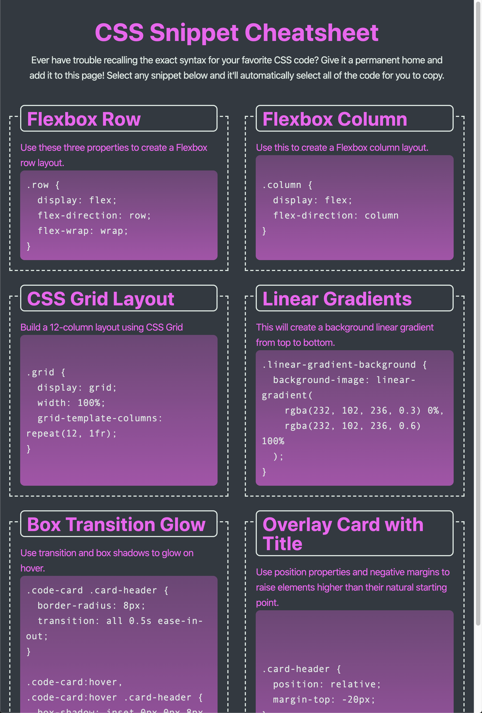

# Impressive Cheats for Your CSS Styling

## Description

Due to the millions of css styling available, it is easier and faster to have some cheats on your fingertips. This website is created to help your CSS styling go to another level in an easy and faster way.

## Table of Contents

- [Installation](#installation)
- [Usage](#usage)
- [Credits](#credits)
- [License](#license)

## Installation
This website has no installation process, just visit https://cheptegei-create.github.io/mini-project-2/

## Usage

The following image shows the web application's appearance and functionality:
    
* At size 992px and above, the app should resemble the following image:

    

* At size 768px and above, the app should resemble the following image:

    

* On mobile devices, anything under 768px, the app should resemble the following image:

    png)
  
## Credits
N/A

## License

Copyright (c) 2020 [David Cheptegei](https://github.com/cheptegei-create)
